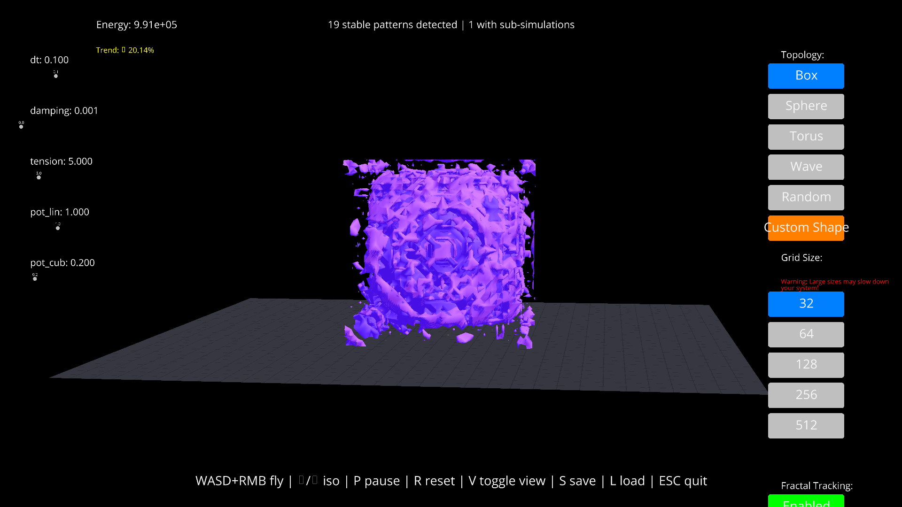

# Magic Box: 3D Fractal Field Simulator

A real-time 3D field simulator that evolves a nonlinear “wave-on-wave” field (`MiniWoW`)  
and detects emergent fractal‐like patterns, promoting them to nested sub‐simulations.

## Features

- 3D field evolution with customizable double-well potential  
- Multiple built-in initial topologies: box, sphere, torus, wave, random, custom  
- Real-time isosurface rendering using marching cubes (Ursina + Matplotlib)  
- Automatic detection & tracking of stable “fractal agents”  
- Nested sub-simulations for long-lived structures  
- Interactive GUI with:
  - WASD + mouse navigation  
  - Sliders for physics params (`dt`, `damping`, `tension`, `pot_lin`, `pot_cub`)  
  - Topology & grid-size selectors  
  - “Poke” tool (mouse click perturbations)  
  - Phase-diagram sweeper  

## Installation

1. **Clone or download** this repo.  

# Install dependencies:

pip install -r requirements.txt

Run:

python main.py

# Controls

WASD + Right-click drag: fly camera

← / →: adjust isosurface threshold

P: pause / resume

R: reset field

V: toggle field ↔ agents ↔ both

S / L: save / load state

ESC: exit

Enjoy exploring your own mini-universe!
